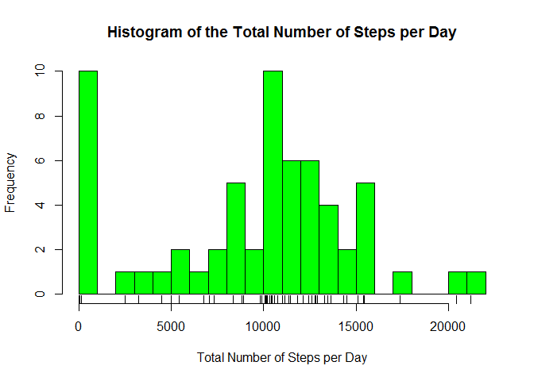
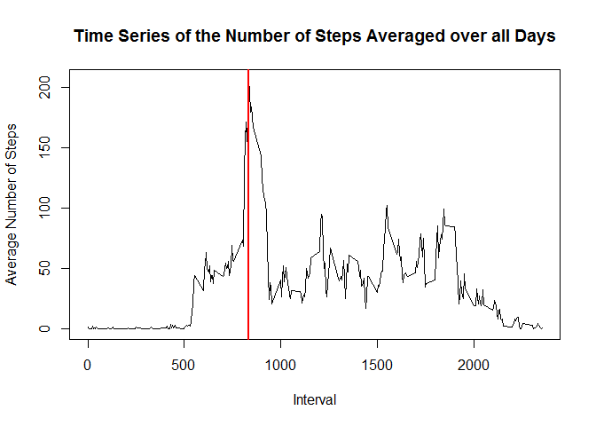
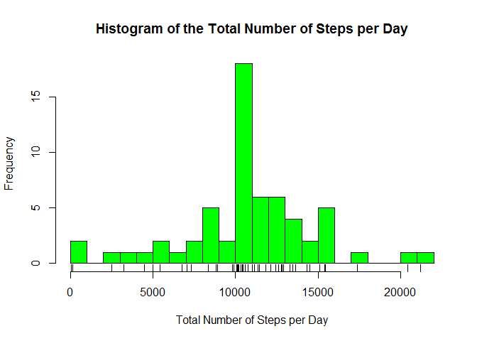
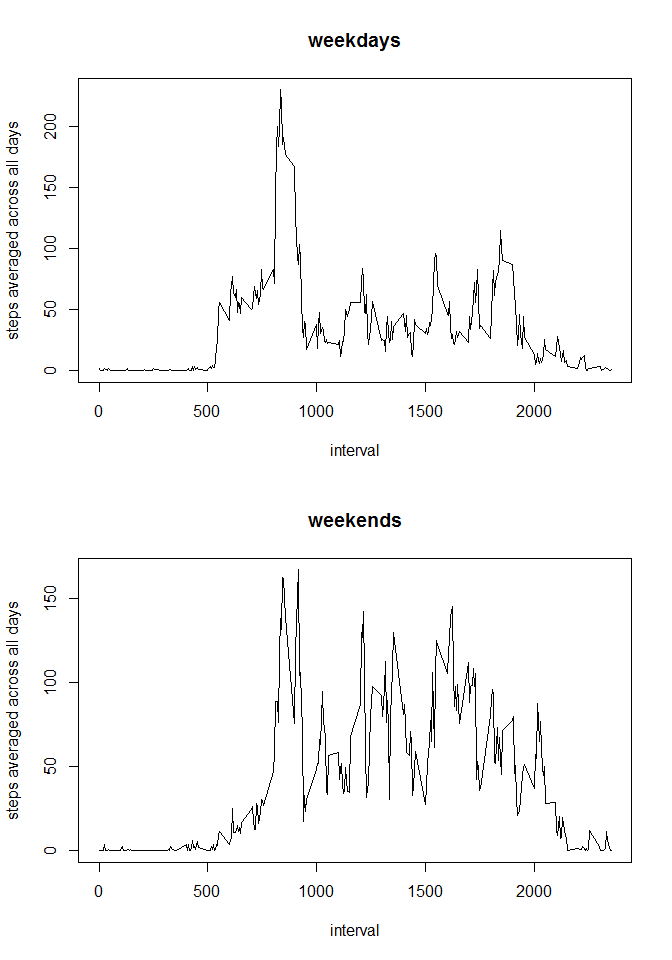

# Reproducible Research: Peer Assessment 1


## Loading and preprocessing the data


```r
library(dplyr)
```

```
## 
## Attaching package: 'dplyr'
## 
## The following objects are masked from 'package:stats':
## 
##     filter, lag
## 
## The following objects are masked from 'package:base':
## 
##     intersect, setdiff, setequal, union
```

```r
fileName <- "activity.csv"
activity <- read.csv(fileName, header = TRUE,  na.strings = "NA")
head(activity)
```

```
##   steps       date interval
## 1    NA 2012-10-01        0
## 2    NA 2012-10-01        5
## 3    NA 2012-10-01       10
## 4    NA 2012-10-01       15
## 5    NA 2012-10-01       20
## 6    NA 2012-10-01       25
```

#### The datasets is "activity.csv". The variables included in this dataset are:

##### steps: Number of steps taking in a 5-minute interval (missing values are coded as NA)

##### date: The date on which the measurement was taken in YYYY-MM-DD format

##### interval: Identifier for the 5-minute interval in which measurement was taken

##### The dataset is stored in a comma-separated-value (CSV) file and there are a total of 17,568 observations in this dataset.


## What is mean total number of steps taken per day?


```r
totalStepsPerDay <- activity %>% group_by(date) %>% summarize(sum(steps, na.rm = TRUE))

names(totalStepsPerDay) <- c("date", "totalNumberofSteps")

## Plot the histogram
hist(totalStepsPerDay$totalNumberofSteps, col = "green", breaks = 30,
     main = "Histogram of the Total Number of Steps per Day",
     xlab = "Total Number of Steps per Day")

rug(totalStepsPerDay$totalNumberofSteps)
```

 

```r
## Mean and Median are:
myMean <- round( mean(totalStepsPerDay$totalNumberofSteps), digits = 0)
myMedian <- median(totalStepsPerDay$totalNumberofSteps)
```

#### The mean and median of the total number of steps taken per day are 9354 and 10395 respectively. 
##### The mean is lower than the median due to the large number of days with zero steps, many of which are NA.


## What is the average daily activity pattern?


```r
## Group by interval and calculate the mean
dailyAveragePerSteps <- activity %>% group_by(interval) %>%
    summarize(mean(steps, na.rm = TRUE))

names(dailyAveragePerSteps) <- c("interval", "dailyAverageNumberOfSteps")

## This is the time series plot of average number of steps from all days versus intervals across a day
plot(x = dailyAveragePerSteps$interval, y = dailyAveragePerSteps$dailyAverageNumberOfSteps, type = "l",
     main = "Time Series of the Number of Steps Averaged over all Days", xlab = "Interval", ylab = "Average Number of Steps")

## mm is the max number of steps averaged over all days
mm <- max(dailyAveragePerSteps$dailyAverageNumberOfSteps)

## ii nis the interval that hosts the highest value mm
ii <- dailyAveragePerSteps[dailyAveragePerSteps$dailyAverageNumberOfSteps == mm,]$interval

## Draw a line at ii
abline(v = ii, col = "red", lwd = 2)
```

 


#### Interval <font color="red">  835 </font> exhibits the highest number of steps with an all-days average of <font color="red"> 206 </font> steps.


## Imputing missing values


Replace the missing steps - coded as NA in the activity data, with the  value averaged over all the days for that interval.  


```r
missing <- length(activity$steps[is.na(activity$steps)])
total <- length(activity$steps)

## Create a dataset to host a new column where steps = NA have been replaced with the average over all days
modified_activity <- activity %>% group_by(interval) %>% mutate(modifiedSteps = ifelse(is.na(steps), mean(steps, na.rm = TRUE), steps))

newTotalStepsPerDay <- modified_activity %>% group_by(date) %>% summarize(sum(modifiedSteps, na.rm = TRUE))

names(newTotalStepsPerDay) <- c("date", "totalNumberofSteps")

hist(newTotalStepsPerDay$totalNumberofSteps, col = "green", breaks = 30,  main = "Histogram of the Total Number of Steps per Day",
     xlab = "Total Number of Steps per Day")
rug(newTotalStepsPerDay$totalNumberofSteps)
```

 

```r
## myMean is ... myMedian is ...
myNewMean <- round( mean(newTotalStepsPerDay$totalNumberofSteps), digits = 0)
myNewMedian <- round( median(newTotalStepsPerDay$totalNumberofSteps), digits = 0)
```

#### There is a large number of missing steps values that potentially biases the analysis. There are 2304 steps with no value provided over a total of 17568 steps in the activity dataset.

##### To remove them, the dataset modified_activity has been created with its missing steps replaced with the average step across all days.  The mean and median of the number of steps taken per day are now calculated to be  10766 and 10766 respectively. The mean and median are much closer from each other to reflect the fact that the bar at steps = 0 has been significantly reduced as compared to the earlier histogram.


## Are there differences in activity patterns between weekdays and weekends?


```r
## Add a column to host the name of the day and another one to decide 
## whether the day is a week end or not

modified_activity$weekday <- weekdays(as.Date(modified_activity$date))
modified_activity <- modified_activity %>% mutate(weekend = ifelse(weekday %in% c("Saturday", "Sunday"), 1, 0))

## Plotting two time series

dailyAveragePerStepsWeekday <- modified_activity %>% 
  filter(weekend == 0) %>% group_by(interval) %>%
    summarize(mean(modifiedSteps, na.rm = TRUE))

names(dailyAveragePerStepsWeekday) <- c("interval", "dailyAverageNumberOfSteps")

dailyAveragePerStepsWeekend <- modified_activity %>% 
  filter(weekend == 1) %>% group_by(interval) %>%
    summarize(mean(modifiedSteps, na.rm = TRUE))

names(dailyAveragePerStepsWeekend) <- c("interval", "dailyAverageNumberOfSteps")

par(mfrow = c(2, 1), oma = c(0, 0, 0, 0))
## This is the time series plot for the weekdays
plot(x = dailyAveragePerStepsWeekday$interval, y = dailyAveragePerStepsWeekday$dailyAverageNumberOfSteps, type = "l", main = "weekdays", xlab = "interval", ylab = "steps averaged across all days")

## This is the time series plot for the weekends
plot(x = dailyAveragePerStepsWeekend$interval, y = dailyAveragePerStepsWeekend$dailyAverageNumberOfSteps, type = "l", main = "weekends", xlab = "interval", ylab = "steps averaged across all days")
```

 

#### The data collected over the weekends shows much more activity distributed across the day.


